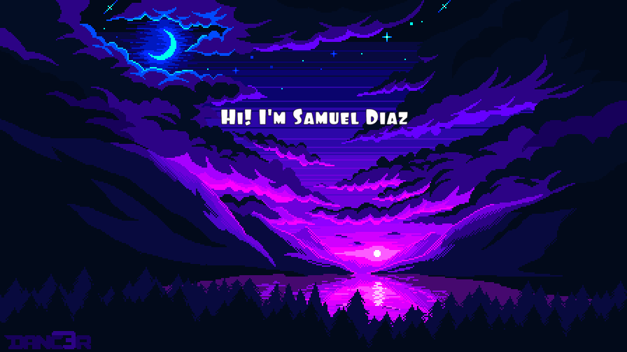

<div align="center">
  
</div>
<div align="center">
  
</div>
---
 
```java
/**
 * @author  Samuel Diaz
 * @github  github.com/samuelLicht
 * @location Tunja, Colombia 🇨🇴
 * @university Universidad Santo Tomás
 */
public class SamuelDiaz extends Developer {
 
    private final String role     = "Estudiante · Ing. de Sistemas";
    private final String[] stack  = { "Java", "Spring Boot", "JavaScript", "Python", "HTML", "CSS" };
    private final String status   = "Aprendiendo y construyendo cada día";
    private boolean openToWork    = true;
 
    public String[] getPassions() {
        return new String[] {
            "Backend con Spring Boot",
            "Desarrollo web full stack",
            "Resolver problemas reales con código"
        };
    }
 
    public void contact() {
        System.out.println("📧 samuelrodolfolicht@gmail.com");
        System.out.println("📸 @samuel_dlicht");
    }
}
```
 
---
 
## ⚙️ Tech Stack
 
<p align="center">
  
  
  
  
  
  
  
  
</p>
---
 
## 📊 GitHub Stats
 
<p align="center">
  
  
</p>
<p align="center">
  
</p>
---
 
## 🏆 Trophies
 
<p align="center">
  
</p>
---
 
## 📡 Conecta conmigo
 
<p align="center">
  <a href="https://www.instagram.com/samuel_dlicht">
    
  </a>
  <a href="mailto:samuelrodolfolicht@gmail.com">
    
  </a>
  <a href="https://github.com/samuelLicht">
    
  </a>
</p>

